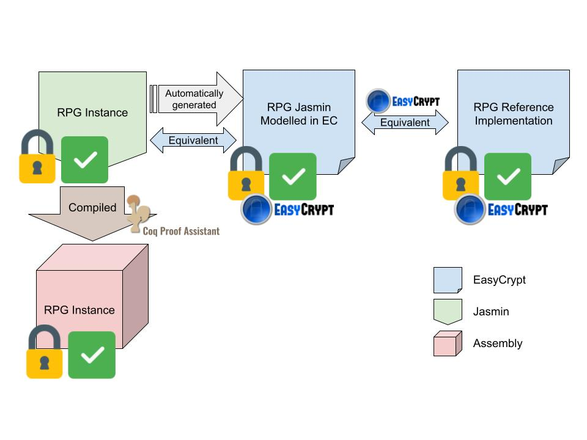

# Random Password Generator
The Random Password Generator (RPG) component of PassCert. The generator is implemented in Jasmin [1] and will be formally verified with EasyCrypt [2]. This repository has the code of the RPG written in Jasmin and also a small example of a C application that uses the generator. Also, it has the specification of a reference implementation written in EasyCrypt of an RPG. The reference implementation is proven to be functionally correct (yet to be proven secure). We also prove that our Jasmin program meets the specification (it is equivalent) and preserves the correctness property (and, in the future, security).

## Structure of the RPG solution



## Dependencies
* [Jasmin Compiler](#https://github.com/jasmin-lang/jasmin)
* [EasyCrypt](#https://www.easycrypt.info/)
* C compiler (I use *gcc* to compile the example)


## Compiling
### Using the Makefile
Having the [jasmin](#https://github.com/jasmin-lang/jasmin) repo next to this one, makes it possible to simply use

```bash
make
```
 to compile the generator and the C example.

### Without the Makefile
One can also compile separately the Jasmin code and the C code using, respectively,
```bash
../jasmin/compiler/jasminc Jasmin/passCertGenerator.jazz -o asm/passCertGenerator.s
```
```bash
gcc C/passwordGeneratorApp.c asm/passCertGenerator.s -o passwordGeneratorApp.out
```
## Running
```
./passwordGeneratorApp.out
```
## Extracting EasyCrypt from Jasmin program
### Using the Makefile
Having the [jasmin](#https://github.com/jasmin-lang/jasmin) repo next to this one, makes it possible to simply use

```bash
make
```
 in the EC folder to extract the EasyCrypt model of the Jasmin program automatically.
 
### Without the Makefile
One can also extract EasyCrypt with the following command
```bash
../../jasmin/compiler/jasminc Jasmin/passCertGenerator.jazz -ec generatePassword -oec passCertGenerator_jazz.ec
```


## References
[1]
Almeida, J.B., Barbosa, M., Barthe, G., Blot, A., Grégoire, B., Laporte, V.,
Oliveira, T., Pacheco, H., Schmidt, B., Strub, P.Y.: Jasmin: High-assurance and
high-speed cryptography. In: Proceedings of the 2017 ACM SIGSAC Conference
on Computer and Communications Security. pp. 1807–1823 (2017)

[2]
Barthe, G., Dupressoir, F., Grégoire, B., Kunz, C., Schmidt, B., Strub, P.Y.: Easy-
crypt: A tutorial. In: Foundations of security analysis and design vii, pp. 146–166.
Springer (2013)
